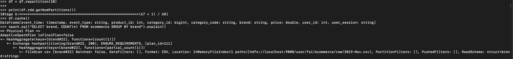

# Kaggle E-Commerce Analysis with Hadoop & Spark

##  Overview
This project demonstrates the setup of **Hadoop & Spark** on a local machine, loading large datasets into HDFS, and analyzing them using Spark SQL.

**Dataset:** Kaggle E-Commerce (285M rows)

---

##  Tech Stack
- **Hadoop** (HDFS & YARN)
- **Apache Spark**
- **PySpark**
- **Kaggle Dataset**

---

##  Setup Instructions

### 1. Install Dependencies
- Hadoop 3.x
- Spark 3.x
- Python 3.x + PySpark

---

### 2. Starting Hadoop Services
To start Hadoop, run:

```bash
stop-yarn.sh
stop-dfs.sh
start-dfs.sh
start-yarn.sh
```


### 3. Upload Dataset to HDFS
After extracting the Kaggle dataset, upload it to HDFS:

```bash
# Create directory in HDFS
hdfs dfs -mkdir -p /user/fai/ecommerce/raw

# Upload dataset
hdfs dfs -put data/raw/2019-Nov.csv /user/fai/ecommerce/raw/

# Verify upload
hdfs dfs -ls /user/fai/ecommerce/raw
```


### 4. Analyze Data with Spark

Start a PySpark session connected to YARN:

```bash
pyspark --master yarn

```

Load the dataset from HDFS:
```bash

df = spark.read.csv("hdfs:///user/fai/ecommerce/raw/2019-Nov.csv", header=True, inferSchema=True)
df.createOrReplaceTempView("ecommerce")
```

Run a SQL query to analyze orders by brand:
```bash

spark.sql("""
    SELECT brand, COUNT(*) as total_orders
    FROM ecommerce
    GROUP BY brand
    ORDER BY total_orders DESC
""").show()
```


### 5. Optimization

To improve Spark performance:

```python
# Repartition data for better parallelism
df = df.repartition(10)

print(df.rdd.getNumPartitions())

# Cache dataframe if used multiple times
df.cache()

# Check query plan
spark.sql("SELECT brand, COUNT(*) FROM ecommerce GROUP BY brand").explain()
```


